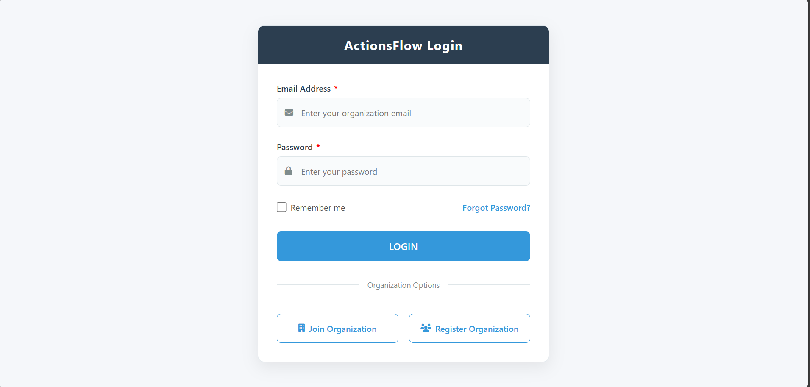
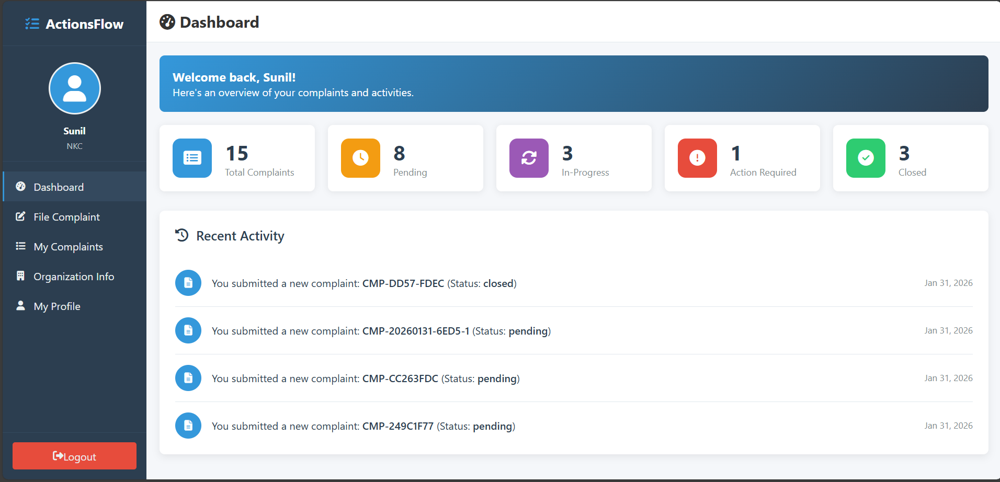
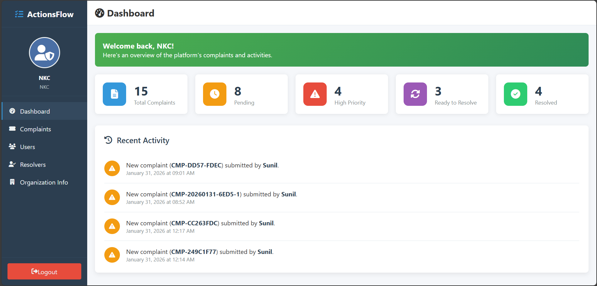

# ActionFlow - Complaint Management System

ActionFlow is a web-based platform designed to streamline complaint resolution within an organization. It provides a structured workflow for users to submit complaints and for administrators and resolvers to manage, track, and resolve them efficiently.

## Key Features

*   **Multi-Organization Architecture:** Supports multiple organizations, each with its own isolated set of users, resolvers, and complaints.
*   **Role-Based Access Control:** Distinct dashboard and permissions for regular Users, organization Admins, and Resolvers.
*   **Complaint Lifecycle Management:** Track complaints from submission (`Pending`) to resolution (`Resolved`) and final closure (`Closed`).
*   **Automated Resolver Assignment:** High-priority complaints are automatically assigned to the least-loaded resolver in the relevant category.
*   **User Feedback System:** Users can provide ratings and feedback on resolved complaints.
*   **Responsive Design:** A clean, mobile-friendly interface for all users.

## Screenshots

| Login Page | User Dashboard | Admin Dashboard |
| :---: | :---: | :---: |
|  |  |  |

## Getting Started

### Prerequisites

*   Python 3.x
*   PostgreSQL

### Installation

1.  **Clone the repository:**
    ```sh
    git clone https://github.com/CodeCloudX/ActionFlow.git
    cd ActionFlow-Postgresql
    ```

2.  **Create and activate a virtual environment:**
    ```sh
    # For Windows
    python -m venv venv
    .\venv\Scripts\activate

    # For macOS/Linux
    python3 -m venv venv
    source venv/bin/activate
    ```

3.  **Install the dependencies:**
    ```sh
    pip install -r requirements.txt
    ```

4.  **Set up the database and environment variables:**
    *   Create a `.env` file by copying the `.env.example` file.
    *   Update the `DATABASE_URL`, `SECRET_KEY`, and other variables in the new `.env` file.

5.  **Run the application:**
    ```sh
    python run.py
    or
    python3 run.py
    ```

## License

This project is licensed under the MIT License - see the [LICENSE](LICENSE) file for details.

Copyright (c) 2026 CodeCloudX
